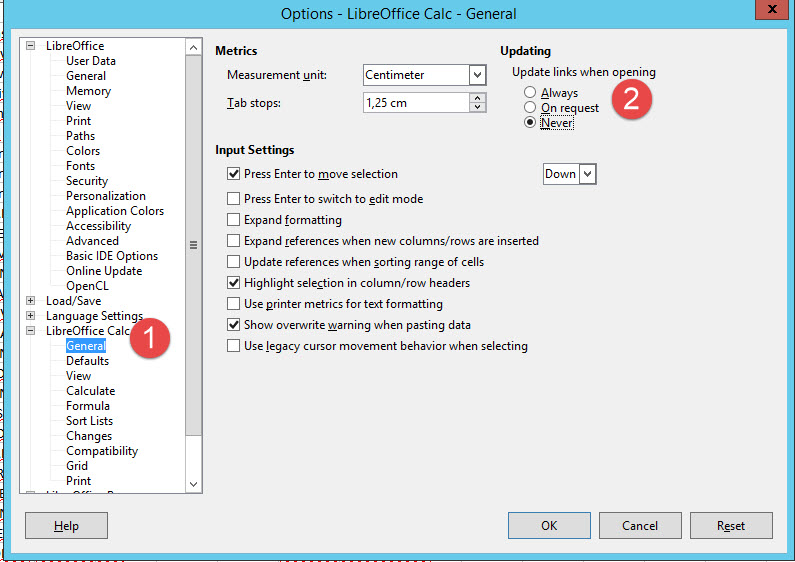

## Ho to configure libreoffice

Actually we supported libreoffice version 5, you can install latest version of 5.x, and it shoudl be fine.

Important: for calc you should disable the update of external link, because if the jobs try to convert a calc file that has external links, it will completely hung. You should simply set the option to Never to never automaticall ask for link update.

